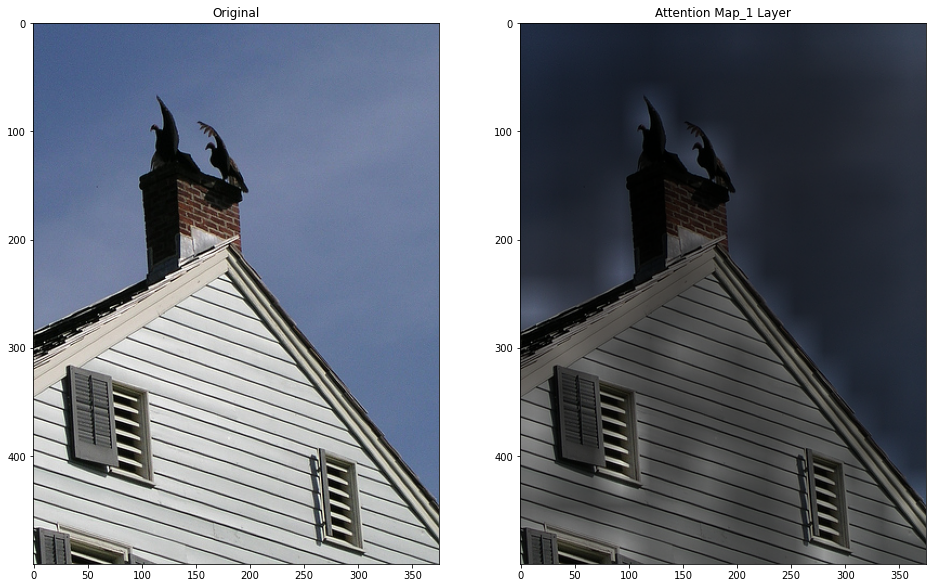
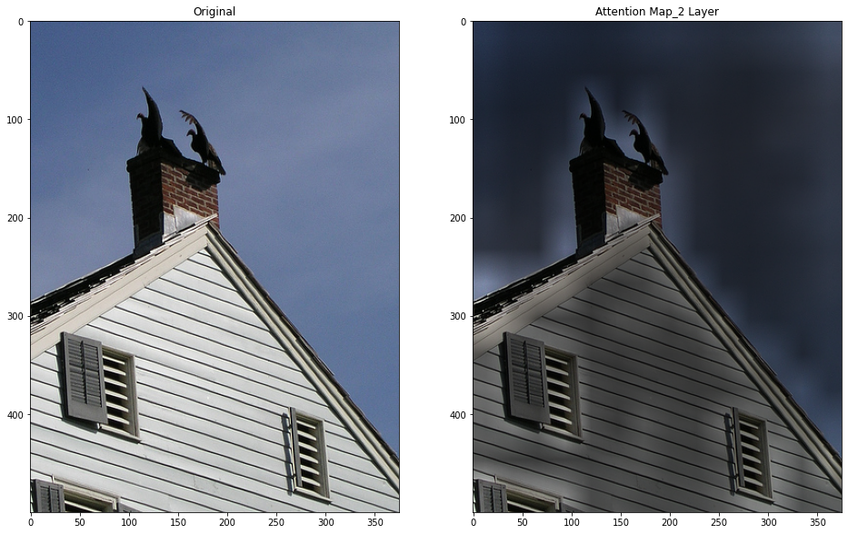
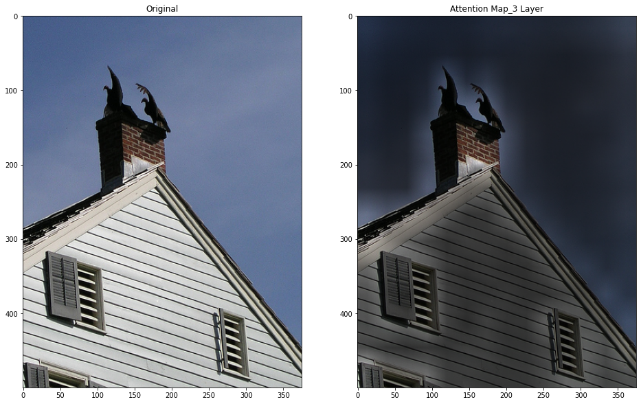
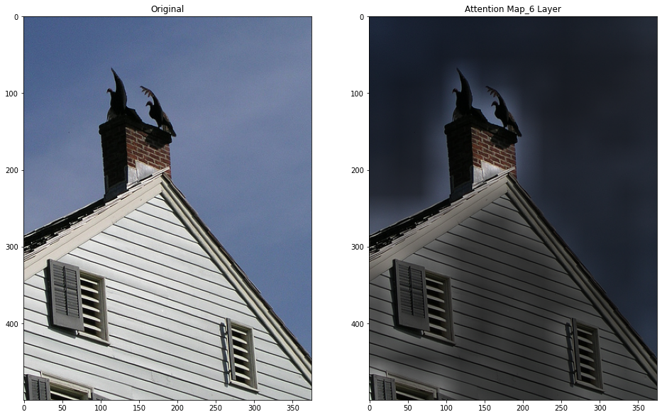
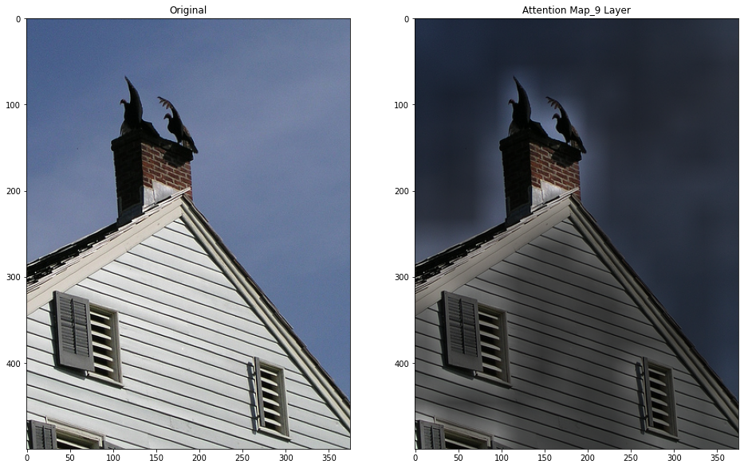
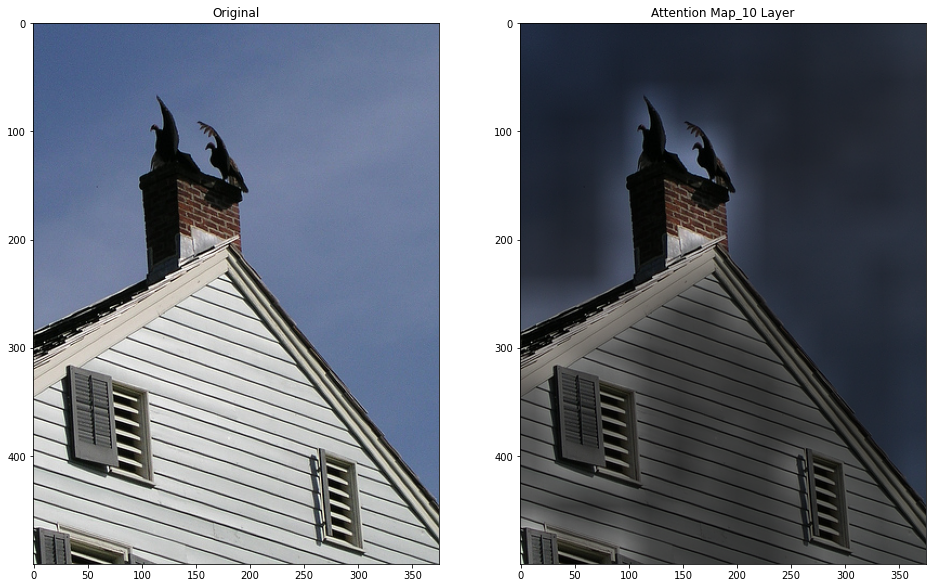

Pytorch Implementation of Vision Transformer . Based on the paper:

  > [An Image is Worth 16x16 Words: Transformers for Image Recognition at Scale](https://arxiv.org/abs/2010.11929)\
  > Alexey Dosovitskiy, Lucas Beyer, Alexander Kolesnikov, Dirk Weissenborn, Xiaohua Zhai, Thomas Unterthiner, Mostafa Dehghani, Matthias Minderer, Georg Heigold, Sylvain Gelly, Jakob Uszkoreit, Neil Houlsby\
  > arXiv:2010.11929

Visualization of attention maps of correctly classified samples can be found in the `_visualizations` folder.

## Imagenet-1k Sample 
### Predicted Label : Vulture
### Real Label : Vulture

### Layer 1

### Layer 2

### Layer 3 

### Layer 4

### Layer 5

### Layer 6

### Layer 7

### Layer 8

### Layer 9

### Layer 10

### Layer 11

### Layer 12

## Usage
The entire code is self contained in the Jupyter notebook,just run the cells sequentially. It is made this way for ease of training on Google Colab.

### To-Do/Coming Soon:
- Finetune on CIFAR-10, CIFAR100 and plot visualizations.
- Implement the hybrid approach based on Resnet feature Maps.

## References
- [jeonsworld](https://github.com/jeonsworld/ViT-pytorch)
- [Attn-Flow](https://github.com/samiraabnar/attention_flow)